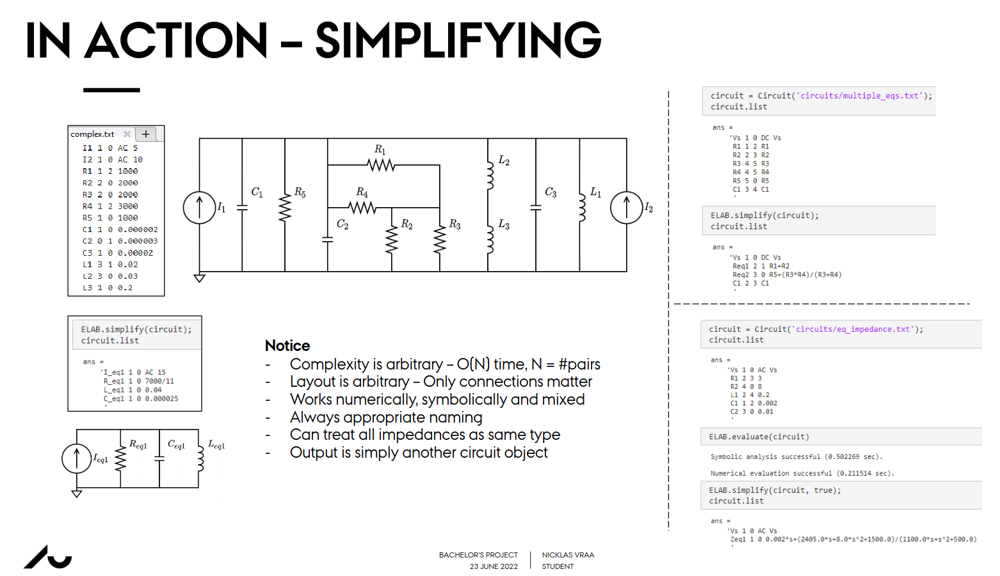

# **ELABorate**
ELABorate is a circuit analysis tool capable of pure symbolic analysis, as well as partial or complete numerical evaluation. Currently written and run in MATLAB. ELABorate is geared towards circuit analysis and design, but has applications for any general system analysis, such as controller design.

<table>
  <tr>
    <td></td>
    <td></td>
  </tr>
  <tr>
    <td></td>
    <td></td>
  </tr>
  <tr>
    <td></td>
    <td></td>
  </tr>
</table>

See the [Wiki](https://github.com/NicklasVraa/ELABorate/wiki/) for a run-down of the program's features, or check out my [bachelor's thesis](programmatic_symbolic_circuit_analysis.pdf) or [bachelor's presentation](ELABorate_presentation.pdf) for all the details.

[**Download**](https://github.com/NicklasVraa/ELABorate/raw/master/build/ELABorate.mltbx) the MATLAB toolbox or add the code directly to your MATLAB workspace.

### **How is it different?**
Contrary to other circuit analysis software, like all SPICE-based programs, ELABorate does not need numerical values, and will tell you how a circuit behaves for ANY numerical value, by returning circuit equations, rather than a number. Doing symbolic calculations allow for much broader understanding of a circuit. A couple of 'symbolic-spice' programs have been emerging very recently, but all are in the demo stage or abandoned and none seem that usable.

### **How does it work?**
The most basic functionality is: give the program a netlist, and it will return the circuit equations. These equations contain all the information one needs to understand the behavior of the circuit.

### **Future Additions**
- Supporting larger structures like ideal-opamps, basic common amplifiers.
- Subcircuit functionality, where you can package a netlist as a single component to be used in other netlists.
- Transfer-function-to-circuit functionality where you define a transfer function and get a netlist in return.
- Image-to-netlist function, using MATLAB computer vision library.

### **Examples**
Below are links to handful of printouts of MATLAB livescripts, that showcase some of the features of ELABorate, as it currently is.
- [Basic Circuit Analysis](https://github.com/NicklasVraa/ELABorate/blob/master/examples/pdfs/circuit_analysis/introduction.pdf)
- [Simplifying circuits](https://github.com/NicklasVraa/ELABorate/blob/master/examples/pdfs/circuit_manipulation/simplifying.pdf)
- [Transistor modelling](https://github.com/NicklasVraa/ELABorate/blob/master/examples/pdfs/circuit_analysis/transistor_circuits.pdf)
- [Transmuting systems](https://github.com/NicklasVraa/ELABorate/blob/master/examples/pdfs/control_systems/transmuting_systems.pdf)

See more examples [here](https://github.com/NicklasVraa/ELABorate/blob/master/examples/pdfs/).

### **Adding elements**
To add an element, have the element class inherit from the `Element` class.
Make sure to update the `Circuit` class, especially the functions relating to updating element arrays.

---
**LEGAL NOTICE**: This repository, including any and all of its forks and derivatives, may NOT be used in the development or training of any machine learning model of any kind, without the explicit permission of the owner of the original repository.
